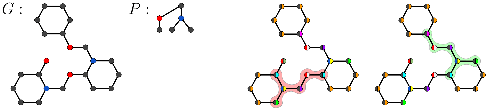

# Graph Neural Networks Can (Often) Count Substructures

This repository implements the models and the experiments in the _ICLR 2025_  (Spotlight) paper "Graph Neural Networks Can (Often) Count Substructures". The paper is available [here](https://openreview.net/forum?id=sZQRUrvLn4).

|  |
|:--| 
| *On the left, a graph **G** and a tree pattern **P**. The copies of **G** on the right have colors obtained from one WL iteration. The subgraph isomorphism from **P** to the red-highlighted subgraph of **G** is not quite-colorful, while the one to the green-highlighted subgraph of **G** is quite-colorful (see Section 5 of the paper).*|


### Description

Message passing graph neural networks (GNNs) are known to have limited expressive power in their ability to distinguish some non-isomorphic graphs.
Because of this, it is well known that they are unable to detect or count arbitrary graph substructures (i.e., solving the subgraph isomorphism problem), a task that is of great importance for several types of graph-structured data. 
However, we observe that GNNs are in fact able to count graph patterns quite accurately across several real-world graph datasets.
Motivated by this observation, we provide an analysis of the subgraph-counting capabilities of GNNs beyond the worst case, deriving several sufficient conditions for GNNs to be able to count subgraphs and, more importantly, to be able to \textit{sample-efficiently learn} to count subgraphs. 
Moreover, we develop novel dynamic programming algorithms for solving the subgraph isomorphism problem on restricted classes of pattern and target graphs, and show that message-passing GNNs can efficiently simulate these dynamic programs. 

### Citing our work

> Paolo Pellizzoni, Till Hendrik Schulz, and Karsten Borgwardt. _Graph Neural Networks Can (Often) Count Substructures_, in ICLR, 2025.

```
@inproceedings{
  pellizzoni2025graph,
  title={Graph Neural Networks Can (Often) Count Substructures},
  author={Paolo Pellizzoni and Till Hendrik Schulz and Karsten Borgwardt},
  booktitle={International Conference on Learning Representations},
  year={2025},
  url={https://openreview.net/forum?id=sZQRUrvLn4}
}
```

### Usage

Run ```source s``` to load modules 

- dataset_statistics/ contains the experiments to compute the dataset statistics (Section 6.1)
- gnns/ contains the experiments on GNNs (Table 1 and Table 4)
